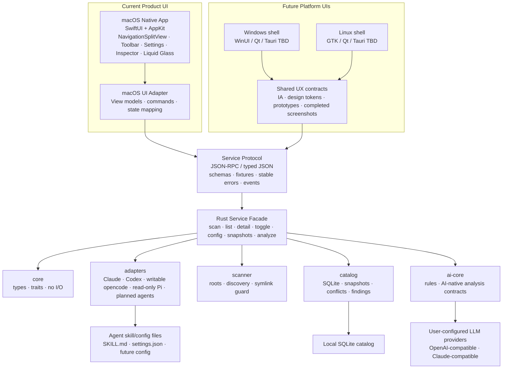

# skills-copilot — 架构总览

> 状态：**V2.64 AI Provider Observability complete；后续连续规划 V2.65 Task-first Cockpit、V2.66 Skill Lifecycle Timeline 与 V2.67 Guided Cleanup Flow**。Claude Code 的扫描、catalog、规则诊断、启停、快照回滚、配置编辑器 MVP、i18n、基础 V1 面板、macOS Native Productization、V2 Prep 安全门、refresh-summary UX、native test hardening 和 adapter evidence gates 已完成。V2 已集成 Codex adapter core、`catalog.scanAll`、Codex user-config toggle 分发、cwd→repo-root project discovery、Project Context、macOS scan-all UI、opencode native/compatibility-root scan and guarded writes、Pi guarded toggle、Hermes external roots、OpenClaw workspace scope、V2.7/V2.30 disabled-by-default LLM prepare/preview、V2.8 rules/permissions governance、V2.9 Tool-global skill pool、V2.10 default-deny skill execution safety、V2.31-V2.40 cleanup/comparison/export/adapter diagnostics、V2.41 provider profile / Keychain-first API key / explicit Test Connection foundation、V2.42 prompt preview/redaction/confirmed provider draft output，以及 V2.43-V2.64 deterministic/read-only AI skill analysis、prompt run history、`session.reviewAgentSkillUse` / `session.listSkillReviews` / `session.deleteSkillReview` app-local agent session skill review、`knowledge.buildLocalSkillMap` local skill map 和 `llm.providerObservability` provider observability。V2.64 observability 只派生 V2.61 prompt run metadata 与 existing minimal provider call metadata，输出 summary、call/history rows、grouping rows、status rows、budget usage hints、retention recommendations、evidence 与 safety flags，不保存 raw prompt/raw response JSON/API keys/credentials/raw traces/unredacted paths，不默认发 provider request；所有真实 provider request 必须先经过 prompt preview/redaction 和用户确认。产品方向已更新为 **Rust 跨平台核心 + 服务协议 + macOS SwiftUI/AppKit 原生壳**；`crates/service` stdio sidecar 和 `apps/macos` SwiftUI 壳是当前产品边界，macOS 原生 UI 是唯一维护的产品 UI。旧 Tauri + React UI / Tauri IPC 壳已删除。详见 [macos-native-plan.md](./macos-native-plan.md)、[service-protocol.md](./service-protocol.md) 和 [ui-delivery-standards.md](./ui-delivery-standards.md)。

## 1. 目标与非目标

**目标**
- 把分散在多个 agent（Claude Code / Codex / pi / hermes / openclaw / opencode）的 skills 统一到一个视图。
- 提供安全的启用/禁用、配置读写、来源校验、版本追踪能力。
- 用本地 scanner/rules/catalog 完成事实获取、元数据检测、配置审计和可验证证据生成。
- 把复杂分析、任务可用性、routing 置信度、trace 判断、remediation、本地 deterministic agent session skill review、本地 skill map、provider observability、task-first cockpit、skill lifecycle timeline 与 guided cleanup 提升为 AI-native 能力；用户可显式配置 OpenAI-compatible / Claude-compatible provider，但 V2.62 session review、V2.63 local skill map 与 V2.64 provider observability 本身不发送 provider request。

**非目标（首版）**
- 不替代各 agent 的运行时（不解析它们的 prompt，不代理它们的工具调用）。
- 不做云端同步、不做账号系统、不收集任何使用数据 —— 隐私约束集中定义在 [security-model.md §5](./security-model.md#5-隐私--数据收集)，其它文档不再重复
- 不做 plugin marketplace（可作为后续阶段）。

## 2. 技术栈决策

| 层 | 选型 | 理由 |
| --- | --- | --- |
| macOS 产品壳 | **SwiftUI + AppKit interop** | 唯一维护的当前产品 UI；半年内优先 macOS 桌面版；原生 `NavigationSplitView`、`Toolbar`、Settings、菜单、可访问性、窗口行为和 Liquid Glass 适配更符合产品目标。 |
| 核心逻辑 | **Rust**（crates） | 多目录扫描、YAML 解析、冲突图计算、文件监听：性能、内存安全、依赖少，都是 Rust 强项。 |
| UI 协议 | **JSON-RPC / typed JSON service boundary** | `crates/service` 已提供 stdio sidecar；让 macOS 原生壳和未来 Windows/Linux shell 调同一套 Rust service；避免把业务逻辑绑死在任何 UI 框架。 |
| 持久化 | **SQLite**（catalog）+ JSON（运行时 UI 状态） | SQLite 存 skills 目录快照、基础元数据、原始 frontmatter、冲突分组；标准化 frontmatter 索引留到后续。UI 状态用本地 JSON 即可。 |
| LLM / AI Analysis | **AI-native 判断层**，通过用户配置的 provider profile 接入 | V2.40 之前只有 disabled-by-default prepare/estimate；V2.41+ 规划 OpenAI-compatible / Claude-compatible endpoint、API key、model 配置。调用前必须 prompt preview/redaction，启用时只发往用户指定 endpoint。 |
| 当前 app 运行 | **Local App Run + Smoke App Run** | 当前阶段只使用 `dist/SkillsCopilot.app`；Local App Run 走真实本机环境，Smoke App Run 走 fixture 环境。正式分发、签名、公证留到后续阶段。 |

**备选：Electron + Node** —— 仅在团队完全无 Rust 经验时考虑。代价是包体、安全模型、内存占用。

> **贡献者门槛说明**：仓库默认要求懂 Rust 写核心。macOS 产品壳贡献需要 SwiftUI/AppKit。轻量规则、fixture、文档和 adapter spec 仍可单语言贡献。

**UI 外观路线**
- macOS 产品壳使用 SwiftUI/AppKit 原生组件；这是唯一当前维护的产品 UI。
- 旧 Tauri Web UI / Tauri IPC 壳已删除；当前产品能力只进入 native macOS shell。
- V2 adapter 主线已接入 Codex writable-user-config adapter、V2.12 guarded writable opencode config/native-install adapter 和 V2.13 read-only Pi adapter。Codex 实现边界继续遵守 `docs/codex-adapter-spec.md` 的 verified roots 和 user-config writable 写入规则；opencode 扫描 native roots 与官方 `.claude` / `.agents` compatibility roots，写入通过 managed `permission.skill`，install 仍限 native opencode roots；Pi 只扫描 Pi-native roots，写入仍 blocked。签名、公证、DMG/ZIP 和 release artifact 自动化等公开发布事务先保留 runbook，等产品更成熟后再执行。
- Liquid Glass 优先通过系统标准组件获得；`apps/macos/Package.swift` 继续以 macOS 13 作为最低部署目标，自定义 macOS 26+ glass API 必须 availability gate 并提供旧系统 fallback。
- SwiftUI 壳不得重写 Rust core。

## 3. 顶层模块



**模块依赖方向（强约束）**：
- `core` 不依赖任何其它 crate（只放纯类型与 trait）
- `adapters` 依赖 `core`
- `scanner` 依赖 `core` + `adapters`
- `catalog` / `ai-core` 依赖 `core`；当前 `ai-core` 不依赖 `adapters`
- `commands` 是业务命令编排层，把上面几块组合起来
- `service` 是 UI 无关的协议边界，当前提供 stdio request/response sidecar
- **禁止反向依赖**：`core` 永远不导入 `adapters` / `scanner` / …

## 4. 数据流：一次"扫描 + 展示"的生命周期

```
1. macOS 原生 UI 触发 service method `catalog.scanAll` 扫描当前已实现的 Claude Code、Codex、guarded writable opencode 和 read-only Pi adapters；`catalog.scanClaude` 保留为 Claude-only 兼容方法。未来文件 watcher 收到 `SKILL.md` / agent config 变更后可自动触发重扫。
2. service facade / commands 调 scanner
3. scanner 对每个 agent 调用对应 adapter.roots(ctx) → 拿到允许扫描根
4. scanner 在允许根内枚举候选 `SKILL.md`，再调 adapter.parse(path) → 拿到 SkillInstance 候选
5. commands 在 upsert 前读取旧 fingerprint，扫描后将 SkillInstance 写入 catalog
6. ai-core 运行 MVP 规则，catalog 刷新 rule findings / skill definitions / conflict groups
7. macOS UI 通过 service methods 拉取当前视图；未来 Windows/Linux UI 只能通过同一协议访问
8. watcher 重扫完成后广播 `catalog-changed`，UI 订阅事件并刷新列表、详情、诊断、冲突与快照
```

## 5. 进程模型

- **当前 V1**：`crates/service` 提供 typed JSON stdio sidecar；`apps/macos` SwiftUI 壳把该 sidecar 打包进 `.app/Contents/Resources` 并通过 `Process` 调用。
- **下一阶段**：把 scan progress / watcher event、Local App / Smoke App 自动化验证补齐；如需要 streaming，再评估 local socket。
- **无常驻后台 daemon**：开应用时启动 service，关应用即退出。若未来需要菜单栏常驻，再单独做权限、生命周期和资源预算设计。

## 6. 扩展点

| 想做的事 | 加在哪 |
| --- | --- |
| 支持新 agent | 在 `crates/adapters/src/<agent_id>/` 新建模块，实现 `AgentAdapter` trait，scanner/catalog 自动接入 |
| 加新规则检查 | 当前在 `crates/ai-core/src/lib.rs` 添加 `Rule` 实现并注册到 `evaluate_mvp_rules()`；后续规则增多再拆 `rules/` registry |
| 接入新 LLM provider | V2.41+ 规划在 provider profile 层支持 OpenAI-compatible / Claude-compatible；当前代码仍只有 prepare/estimate gate，不能假定已有真实 provider client、网络调用或 credential storage |
| macOS 原生 UI 新面板 | 在 `apps/macos/` SwiftUI shell 新增 view/model，调用同一 service method |
| 新 shell | 只接 service protocol，不直接引用 scanner/catalog internals |
| 配置编辑器 | commands 层新增 typed 读写 command；写前 snapshot、校验、原子写、写后 rescan 仍在 Rust service 层 |

新增 agent 的关键约束（参见 [`agent-adapters.md`](./agent-adapters.md)）：
- 适配器必须是无状态的（不要缓存文件内容）
- 解析失败不能让整个 scan 崩，要降级为 `state=broken` 并记日志
- 任何写操作（toggle、edit config）必须走"原子写 + 回滚"路径
- Codex adapter 只能扫描已验证的 user/project `.agents/skills` roots；首版 toggle 只写用户 `config.toml`，不得写 `<repo>/.codex/config.toml` 或扫描 plugin/admin/system roots
- Opencode adapter 扫描官方 roots：`~/.config/opencode/skills`、active project `.opencode/skills`、全局/项目 `.claude/skills`、全局/项目 `.agents/skills`；custom `skills.paths` / `skills.urls` 仍 deferred。Writes 只能走 managed `permission.skill` config override，install 只能写 native opencode roots

## 7. 错误与日志

- 所有 adapter/scanner 错误用 `thiserror` 定义 `Error` 枚举，不抛 `anyhow!` 顶层。
- 日志走 `tracing` + `tracing-subscriber`，默认 level = `info`，`--debug` 时 `debug`。
- 用户可见的错误：UI 用 toast + 详情折叠；非阻塞类（某个 skill 解析失败）只在该 skill 行内显示，不阻断全局扫描。

## 8. 国际化 (i18n)

- **当前产品状态**：macOS 原生壳通过 `UIStrings` + Swift `Localizable.strings` 管理平台内 i18n，当前支持 English (`en`) 与简体中文 (`zh-Hans`)
- **语言设置**：`Settings` scene 提供 app-local 语言偏好；偏好只写入 `UserDefaults`，不会写 agent config、skill 文件、provider 设置、凭据、报告或 prompt artifact
- **文案 key**：用户可见字符串应集中到 `UIStrings`，并复用稳定错误码 / 文案 key；带运行时值的文案优先使用 `format` 路径，避免本地化资源吞掉动态数量或名称
- **LLM prompt**：始终英文 —— 多数模型在英文下指令遵循更稳
- **错误码**：稳定不变；用户可见消息文案走 i18n；内部日志保持英文
- 进度安排见 [roadmap.md](./roadmap.md)

## 9. 文档地图

- [agent-adapters.md](./agent-adapters.md) — 6 个 agent 的目录约定与适配要点
- [codex-adapter-spec.md](./codex-adapter-spec.md) — Codex adapter 证据、实现边界与 fixture 工作单
- [macos-native-plan.md](./macos-native-plan.md) — macOS SwiftUI/AppKit 原生壳与跨平台 service protocol 计划
- [service-protocol.md](./service-protocol.md) — native shell / future platform shell 的 typed JSON request-response 边界
- [ui-delivery-standards.md](./ui-delivery-standards.md) — UI 原型、完成截图和 macOS Computer Use 验证标准
- [macos-app-runbook.md](./macos-app-runbook.md) — macOS Local App Run / Smoke App Run 规范
- [ai-agent-workflow.md](./ai-agent-workflow.md) — Codex / Claude Code / Pi / opencode 等 coding agent 共享入口、验证和文档同步规则
- [deprecated-web-ui-removal.md](./deprecated-web-ui-removal.md) — 旧 Web UI 删除记录
- [data-model.md](./data-model.md) — 统一 Skill 数据模型
- [ai-layer.md](./ai-layer.md) — 规则引擎 + LLM 层
- [security-model.md](./security-model.md) — 权限、白名单、注入面、回滚
- [mvp-implementation-plan.md](./mvp-implementation-plan.md) — MVP 施工图与 Claude Code toggle 语义
- [roadmap.md](./roadmap.md) — MVP / Product UI/UX Hardening / V1 / macOS Native Productization / V2 路线图
